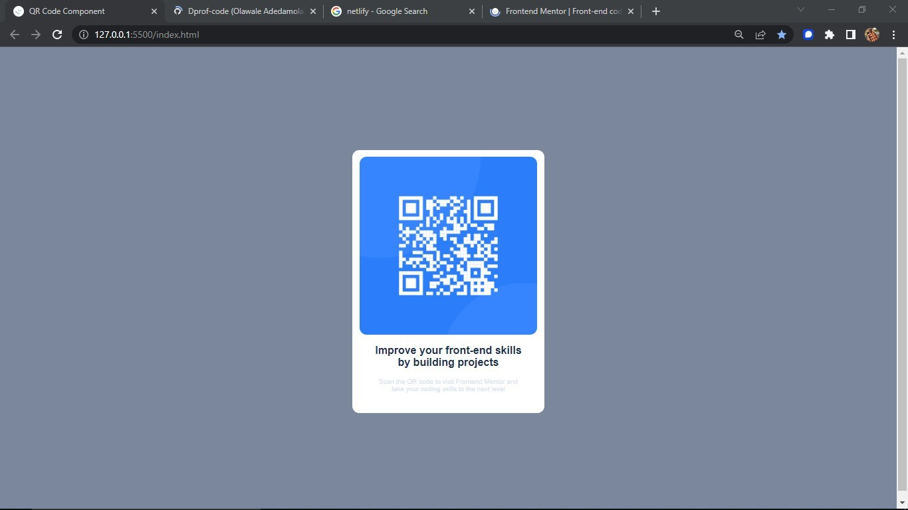
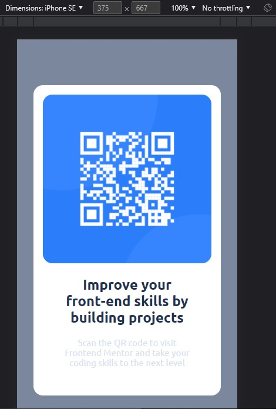

# Frontend Mentor - QR code component solution
 

## Table of contents

- [Overview](#overview)
  - [Screenshot](#screenshot)
  - [Links](#links)
- [My process](#my-process)
  - [Built with](#built-with)
  - [What I learned](#what-i-learned)
  - [Continued development](#continued-development)
- [Author](#author)


## Overview

This is a solution to the [QR code component challenge on Frontend Mentor](https://www.frontendmentor.io/challenges/qr-code-component-iux_sIO_H). Frontend Mentor challenges help you improve your coding skills by building realistic projects.

### Screenshot





### Links

- Solution URL: (https://github.com/Dprof-code/QR-code-component)
- Live Site URL: (https://ephemeral-custard-53b3c8.netlify.app/)

## My process

### Built with

- Semantic HTML5 markup
- CSS custom properties
- Flexbox
- Media Queries


### What I learned

I understand better on positioning HTML elements with the use of flexbox.


```css
main {
    max-width: 100%;
    height: 100vh;
    display: flex;
    align-items: center;
    justify-content: center;
}
```

### Continued development

I am still trying to perfect my skills on Flexbox and Grids.

## Author

- Website - [Olawale Adedamola](https://www.linkedin.com/in/olawale-adedamola-b9b1641a2/)
- Frontend Mentor - [@Dprof-code](https://www.frontendmentor.io/profile/Dprof-code)
- Twitter - [@pr0devs](https://www.twitter.com/pr0devs)